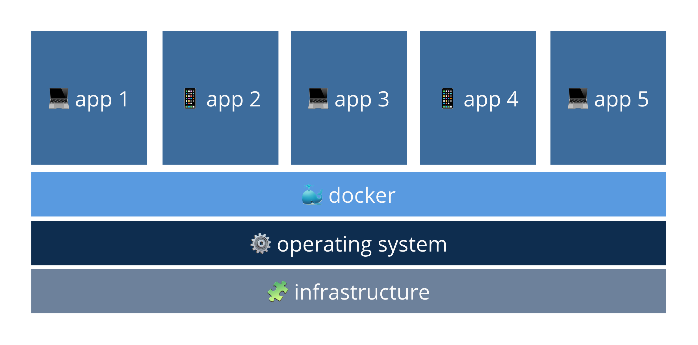
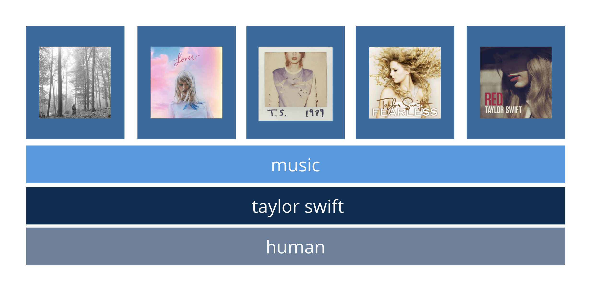

Docker is a containerization platform that allows you to easily package up your software without stressing over the hardware. It doesn't need all the fancy fixings such as the hypervisor or separate systems, only the operating system's kernel. 

A simple way to think of Docker as a containerization platform is through music creation. Docker's server can be thought of as 'music' while each container could be thought of as a separate 'song'. They each share a common operating system, the artist, but the songs are independent from one another and aren't correlated. 

Carrying the analogy further, we can think of the Dockerfile or image as the sheet music. This is the template that's used to create the container, i.e. the song. 

Even *more* granular, Docker compose can be thought of as the album. A system in which we're correlating to multiple songs, i.e. multiple containers to communicate across a larger system. 

Can also be seen as this 👇🏼 ✨																								

Whale, that was simpler than you were imagining, huh? 

Of course it can get more complicated. There are specific docker commands, there's understanding the Docker daemon and  Docker compared to virtual machines, but we'll leave it to others to get into the weeds. 

These are two articles that I believe explain the depths of Docker with clarity: 

- [Docker and why it's popular](https://www.zdnet.com/article/what-is-docker-and-why-is-it-so-darn-popular/)
- [Container revolution](https://www.infoworld.com/article/3204171/what-is-docker-the-spark-for-the-container-revolution.html)

If you're anything like me and would rather build and break things to understand a concept, here are two great videos walking you through docker and docker compose:

* [Docker in 12 mins](https://www.youtube.com/watch?v=YFl2mCHdv24&t=183s&ab_channel=JakeWright)

* [Docker compose](https://www.youtube.com/watch?v=Qw9zlE3t8Ko&ab_channel=JakeWright)

That's it folks, short and simple. Docker is a service that most companies are adopting so ya better saddle up and ride the whale 🐳! 

